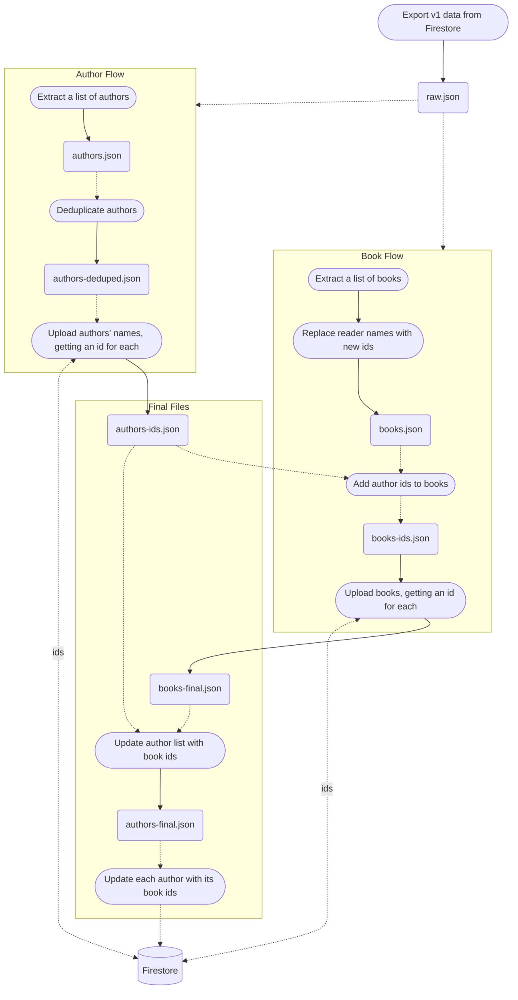

```mermaid
flowchart TB
  %% Files:
  1(raw.json)
  2(books.json)
  3(authors.json)
  4(authors-deduped.json)
  5(authors-ids.json)
  6(books-ids.json)
  7(books-final.json)
  8(authors-final.json)

  %% Export:
  E([Export v1 data from Firestore])
  E --> 1
  1 -.-> sg1
  1 -.-> sg2

  %% Authors:
  A([Extract a list of authors])
  AA([Deduplicate authors])
  AB([Upload authors' names, getting an id for each])
  AC([Update each author with its book ids])
  subgraph sg1[Author Flow]
    A --> 3
    3 -.-> AA
    AA --> 4
    4 -.-> AB
  end
  AB --> 5

  %% Books:
  B([Extract a list of books])
  BA([Replace reader names with new ids])
  BB([Add author ids to books])
  BC([Upload books, getting an id for each])
  subgraph sg2[Book Flow]
    B --> BA
    BA --> 2
    2 -.-> BB
    BB -.-> 6
    6 --> BC
  end
  BC --> 7

  %% Final
  F([Update author list with book ids])
  subgraph sg3[Final Files]
    5 -.-> BB
    5 -.-> F
    7 -.-> F
    F --> 8
    8 -.-> AC
  end

  %% Firestore:
  DB[(Firestore)]
  DB <-. ids .-> AB
  DB <-. ids .-> BC
  AC -.-> DB
```
