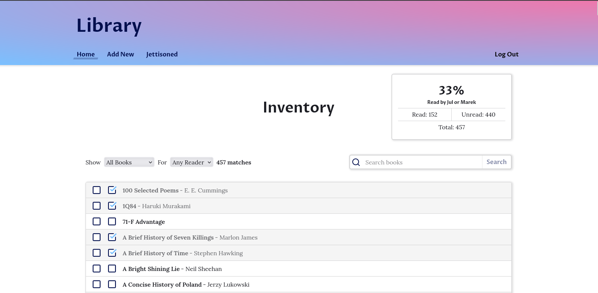

# Library

## What is Library?

Born out of my inability to stop buying books, Library is an over-engineered tool to inventory the books that I own, track which of those books I've read, and shame me into reading more of them. I've open sourced this project so that you too can visualize your collection and join me living in guilt.

## Uh, Okay... But What's in This Repo?

The repo contains everything needed to run your own instance of Library including:

1. The `web` directory - A frontend built in [SolidJS](https://www.solidjs.com/) deployed as a static site (well, static assets with data retrieved via API Gateway).
1. The `serverless` directory - A series of [Google Cloud Functions](https://cloud.google.com/docs/overview) written in [Go](https://go.dev/) to manage all the CRUD operations for the site's data, which is stored in a [Firestore](https://cloud.google.com/firestore) database.
1. The `.config` directory - The tooling necessary to deploy the application in full to Google Cloud by means of a [Terraform](https://developer.hashicorp.com/terraform) configuration.

## Deployment

### Terraform

This repo contains a full Terraform configuration in the `.config/terraform` directory. This configuration sets up all the necessary Google Cloud resources including:

1. A Cloud Storage bucket to store terraform state and build artifacts
1. A Cloud Storage bucket in which to deploy the static site assets
1. A Firestore database to store application data
1. Cloud Functions that execute all the database operations
1. An API Gateway to serve as an intermediary between the frontend and the serverless functions
1. A Cloud Scheduler job to ping the API Gateway every ten minutes (reduces cold start times)
1. An Auth0 client with Google OAuth integration to authenticate users. Authenticated users are the only ones allowed to add/edit data.
1. A custom Auth0 action to limit user registration/authentication to a provided whitelist of user emails addresses.

### Assumptions

- The frontend will be deployed to a publicly available bucket using the same name as the site's domain. If this is the case you will need to [verify ownership of the domain before creating the bucket](https://cloud.google.com/storage/docs/domain-name-verification). If using a different setup (ex. using [Cloud CDN to put a load balancer in front of a non-public bucket](https://cloud.google.com/cdn/docs/setting-up-cdn-with-bucket)) you will need to tweak the Terraform configurations a bit.
- Authentication for this app is handled by [Auth0](https://auth0.com/docs). In order to set up the requisite Auth0 client you must first [create a machine-to-machine application](https://registry.terraform.io/providers/auth0/auth0/latest/docs/guides/quickstart) authorized to create Auth0 resources on your behalf.

### CLI

The repo also has a built-in CLI tool that can be used to easily manage various operations related to building and deploying the project. This tool is included as a binary that can be started by running `./cli` from the root of the project. The source for this binary is found in the `.config/cli` directory and the binary can be recompiled and replaced by running `go build -o ../../` from that directory. Operations available via the CLI tool:

- Prepare the cloud functions for deployment and sync those that have changed to the source bucket in Google Cloud Storage.

## Roadmap

Below is list of features that may (or may not) be added to the project in the future:

- 🚧 **Ebook Tracking** - Allow users to indicate the format of a given book. This allows for separate lists of print books and ebooks. Also allow users to indicate a print book's cover (softback, hardcover) or ebook vendor (ex. Kindle, Kobo, Google Play).
- 🚧 **Offline Access** - Make the application installable as a [progressive web app](https://web.dev/explore/progressive-web-apps) caching assets and data on users' devices and allowing them to review and manage lists when offline. Implement background data fetching to ensure that data is up to date and users have a snappy load when opening the app.
- 📆 **Enhanced Statistics** - Automatically compute progress towards (or away from) the goal of reading all your books. Could show interesting stats like reading velocity, net book in-out over time, and print/digital breakdowns.
- 📆 **Augmented Author Information** - Create a more robust author data structure including biographical information, awards, etc.
- 💡 **Reader Profile** - A page for each reader showing their personal lists, statistics, and (potentially) collections and ratings.
- 💡 **Collections** - Allow users to create collection of books based on any arbitrary criteria (ex. favorites, categories).
- ⛔ **Book Ratings** - Allow users to rate the books that they have read - requires reader profiles.
- 🤔 **Unowned Books** - Add support for creating lists of unowned books. This item kind of cuts against the stated purpose of the application, but would allow for the creation of notional collections like wish lists or recommendations.
- 🤔 **Integrated Ebook Reader** - Allow users to upload the digital books they own and read them from within the app. Should be fairly simple for PDFs, but more complex for epub and mobi files.
- 🤔 **Audiobook Tracking** - Similar to ebook tracking. Probably a low-effort addition, but not a use case I personally need.
- 🤔 **Integrate 3rd Party Reading Trackers** - There are many great apps for tracking the books you've read ([Goodreads](https://www.goodreads.com/) and [StoryGraph](https://www.thestorygraph.com/) come to mind). Library serves a similar but somewhat distinct purpose to these trackers. It would be nice to centralize the management of all this data in one place. Would require some feasibility research into the APIs these services provide.

**Roadmap legend:**

| Icon | Description         |
| ---- | ------------------- |
| ✅   | Completed           |
| 🚧   | In Progress         |
| 📆   | Planned             |
| 💡   | Good Idea           |
| ⛔   | Blocked             |
| 🤔   | Under Consideration |

## Questions

### This is pretty complicated, couldn't you do all this in a spreadsheet?

Yes.

### All this infrastructure seems expensive, is it expensive?

Not really. The nice thing about the serverless approach taken by this application is that you only get billed for what you use. So long as you have a limited number of users and traffic remains reasonable, you should comfortable stay within Google's free tier. That said, it is never a bad idea to [set up budgets and billing alerts](https://cloud.google.com/billing/docs/how-to/budgets) so as to avoid unwelcome surprises.

### Why Google Cloud? Can I deploy this to a different cloud provider?

The choice of Google Cloud was pretty much arbitrary. I'm already quiet familiar with AWS and wanted to try something different. Other cloud providers offer analogous services so in theory you could deploy to a different environment. That said, Google Cloud Function are not a drop-in replacement for AWS Lambdas or Azure Functions so the whole `serverless` directory would have to be refactored. Similarly, the Terraform configuration would have to be adapted to the cloud of your choosing.
